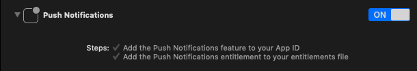

# GeoOffersSDK

## GeoOffers: rewards platform for smarter cities
https://zappitrewards.com

## What is it?
The GeoOffersSDK lets you turn your mobile app into a powerful marketing tool. Effortlessly add geolocation driven proximity experiences to your app, engage your users and understand them with analytics. The SDK lets you quickly connect to the GeoOffers platform where you can configure your campaigns and marketing setup.

## How to use it

It is recommended to install the GeoOffersSDK using CocoaPods. The SDK supports a minimum iOS version of 11.4.

### CocoaPods
1. if you haven't already, install CocoaPods by executing the following:
```
$ sudo gem install cocoapods
```
> If you encounter any issues installing cocoapods, please refer to their [getting started guide](https://guides.cocoapods.org/using/getting-started.html)
2. add the following to your Podfile:
```
pod 'GeoOffersSDK'
```
3. install your pod updates with:
```
pod install
```
4. open the project workspace, not the project file and ensure the dependencies loaded properly.

## Configuration
This section describes how to configure the iOS SDK for use in your app.

### App info.plist
Make sure that the following entries are in your info.plist
| Key | Type | |
| --- | --- | --- |
| NSLocationAlwaysUsageDescription   | String  | We will use your location to provide relevant location based offers for you.|
| NSLocationAlwaysAndWhenInUseUsageDescription   | String  | We will use your location to provide relevant location based offers for you.|
| NSLocationWhenInUseUsageDescription   | String  | We will use your location to provide relevant location based offers for you.|

> **Important**
> If these keys are not present in your **_info.plist_** iOS location services won't start, preventing the app from GeoFencing and receiving location updates.

### App Capabilities
The GeoOffersSDK requires the app to enable selected _Capabilities_. Open the project in XCode, go to the Target, and select the _Capabilities_ configuration page.

Within the _Background Modes_ section, ensure the following entitlements are enabled:
• Background Fetch
• Remote Notifications
• Location updates


You should also enable _Push Notifications_ and provide the platform with a _Push Notification AppKey_ or _Push Notification Certificates_



### SDK Configuration

You should receive a **_registrationCode_** and **_authenticationToken_** from the platform.
